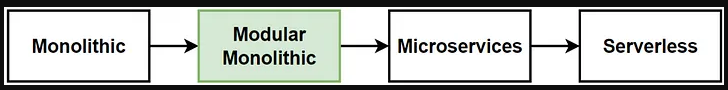
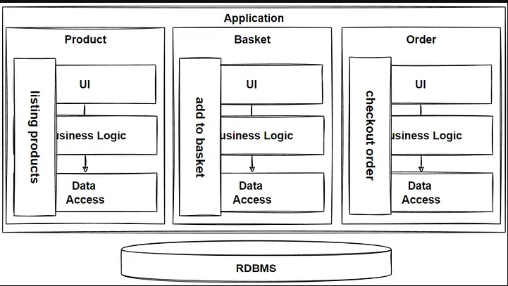

# Backend For Frontend (BFF)


## Concepts Used

- [BFF Pattern](https://aws.amazon.com/pt/blogs/mobile/backends-for-frontends-pattern/#:~:text=According%20to%20Sam%20Newman%2C%20the,one%20general%2Dpurpose%20API%20backend.)
- [Modular Monolith](https://medium.com/design-microservices-architecture-with-patterns/microservices-killer-modular-monolithic-architecture-ac83814f6862)
    - [Bounded Context](https://martinfowler.com/bliki/BoundedContext.html)
- [GraphQL](https://docs.nestjs.com/graphql/quick-start)
- [Filters](https://docs.nestjs.com/exception-filters)
- [Dependency Injection](https://docs.nestjs.com/fundamentals/custom-providers#non-class-based-provider-tokens)
- [Swagger](https://docs.nestjs.com/openapi/introduction)
- [Docker](https://docs.docker.com/get-started/overview/)
- [Docker compose](https://docs.docker.com/compose/)
- [REDIS Queue](https://redis.com/glossary/redis-queue/)
    - [bull](https://www.npmjs.com/package/bull)
- [Observability](https://www.splunk.com/en_us/blog/learn/observability.html#:~:text=Simply%20put%3A%20Observability%20is%20the,from%20outputs%2C%20namely%20sensor%20data.)
    - [Open Telemetry](https://opentelemetry.io/)
    - [Honeycomb.io](https://www.honeycomb.io/)
- Calling another APIs
    - [Axios](https://axios-http.com/ptbr/)

## Modular Monolith

This is architecture design journey



The construction of the application



## Installation

Node version used is `v16.20.0`, so in your terminal run the follow:

`npm install` or `yarn`

To start the project

`npm run start:dev`

### Running with Swagger

Once the application is running you can visit [http://localhost:3000/api](http://localhost:3000/api) to see the Swagger interface.

See [here](https://docs.nestjs.com/recipes/swagger#bootstrap) for more information.

### Running with GraphQL

Once the application is running you can visit [http://localhost:3000/graphql](http://localhost:3000/graphql) to see the GraphQL Playground interface.

See [here](https://docs.nestjs.com/graphql/quick-start) for more information.

#### Examples

*Create*

```graphql
mutation createTest {
  create(
    data: {
      name: "test"
      age: 1
      breed: "raca"
      photo: "https://example-image.jpg"
    }
  ) {
    name
    age
    breed
    photo
  }
}
```

*Get*
```graphql
query test {
  findOne(id: 0) {
    name,
    age,
    photo
  }
}
```

## Docker

*Generate image*

`docker build -t bff-example-image .`

*Run container*

`docker run --name bff-example-container -dp 127.0.0.1:3000:3000 bff-example-image`

### Docker Compose

*Up*

`docker-compose up`

*Down*

`docker-compose down`
